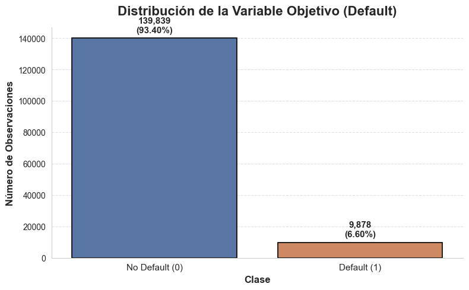
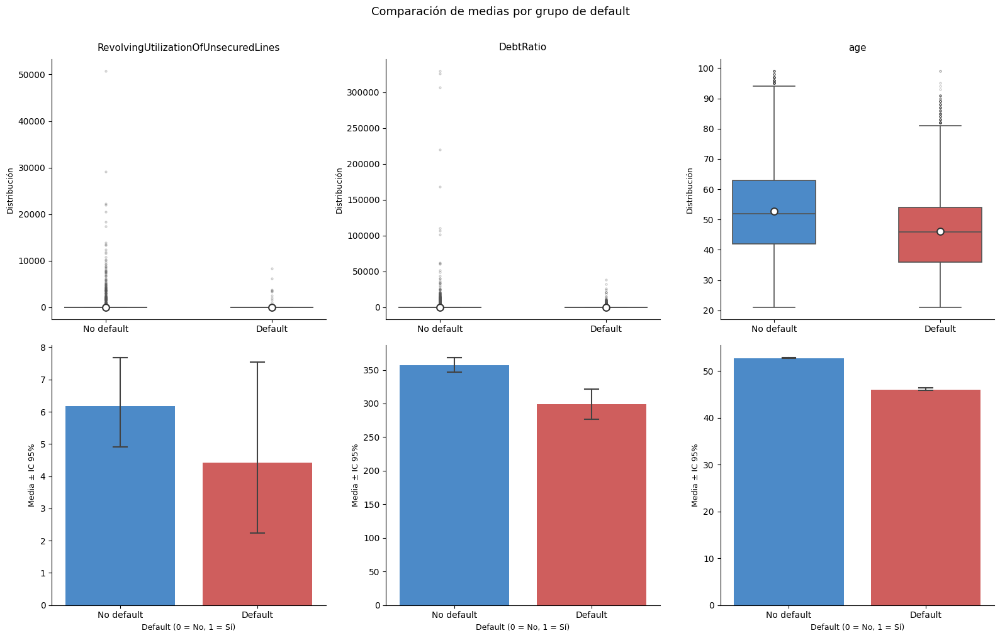
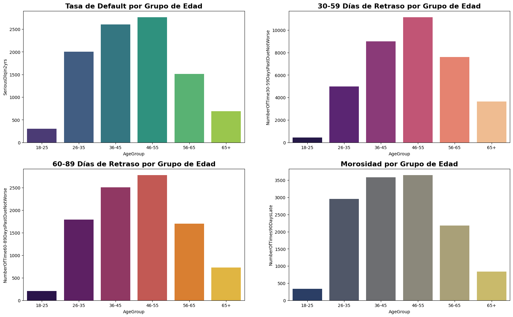
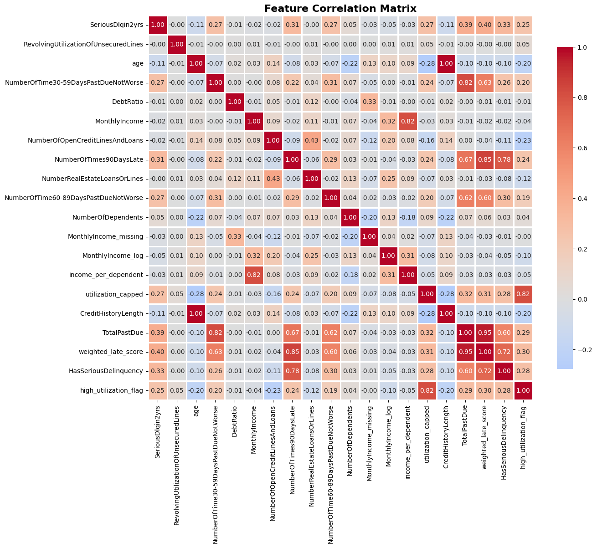
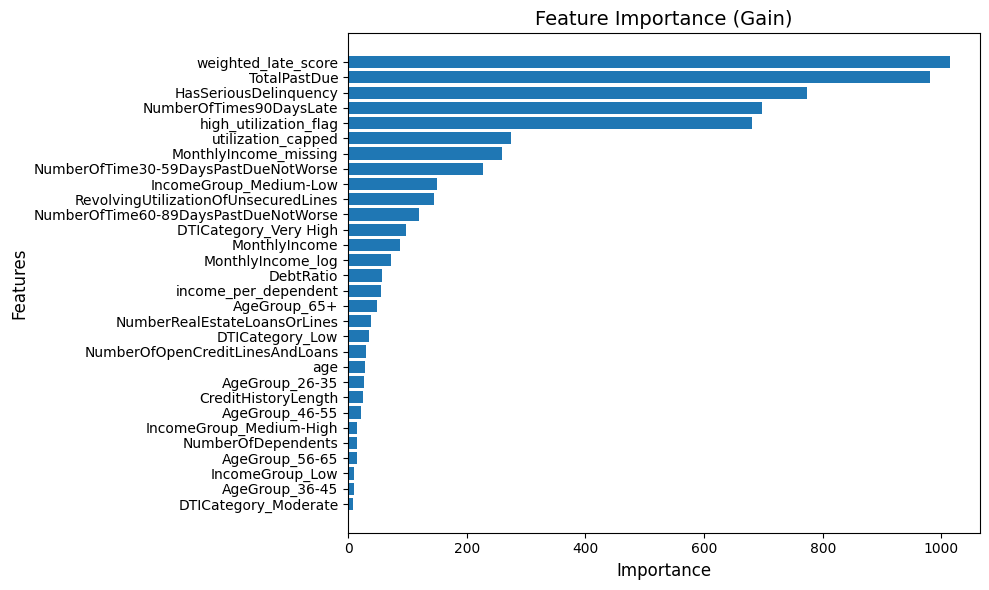
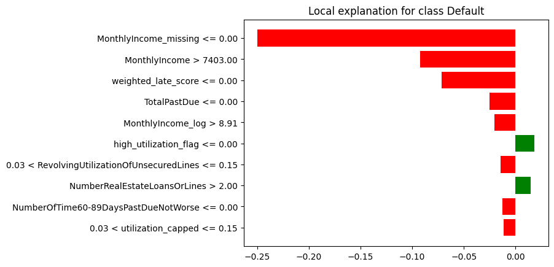
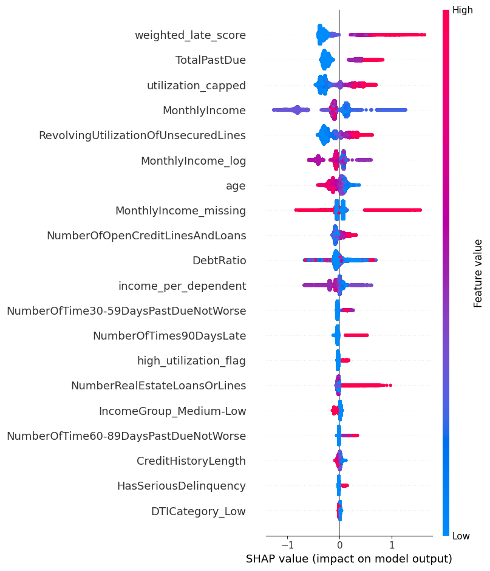

 # 🏦 Credit Default Prediction

> Proyecto de ML end-to-end · Clasificación Binaria · Limpieza de datos · Feature Engineering · Regresión Logística · XGBoost + SHAP + LIME 

    

---

## Resumen

Este proyecto desarrolla un sistema integral y listo para producción para la predicción del riesgo de impago crediticio a partir de datos financieros estructurados. En él, se abarca todo el ciclo de vida del modelo, desde el análisis exploratorio de datos y featuring engineering hasta el entrenamiento de modelos de machine learning y el análisis de explicabilidad mediante valores SHAP. Se evaluaron distintos enfoques, como Regresión Logística y XGBoost, abordando de forma específica el fuerte desbalanceo del conjunto de datos (93%-7%) mediante técnicas adecuadas para este tipo de problemática. XGBoost fue finalmente seleccionado por su sólido rendimiento predictivo y su capacidad para afrontar eficazmente este escenario. El modelo final obtenido permite estimar de manera fiable la probabilidad de que un cliente incurra en dificultades financieras en un horizonte de dos años, contribuyendo así a mejorar la toma de decisiones en concesión de crédito. 

## 🎯 Puntos clave  

- Se ha creado un modelo de ML de predicción de riesgo de morosidad con un dataset amplio (100k+ filas), con una variable target severamente desbalanceada (93%-7%).
- En el eda se han detectado algunos patrones interesantes y útiles para una posible toma de decisiones de negocio.
En el modelado se puso especial énfasis en optimizar el equilibrio entre el recall de la clase minoritaria y la precisión global del modelo (F1-score), ajustando hiperparámetros y threshold según este criterio. Por requisitos de negocio, se decidió fijar un recall mínimo de 0.65 para la clase minoritaria y, a partir de ahí, se seleccionó la configuración con mejor F1-score para dicha clase.
- Adicionalmente, se realizó un proceso de feature engineering orientado a generar variables relevantes que permitieran capturar el historial crediticio de cada individuo y mejorar la capacidad del modelo para discriminar entre distintos niveles de riesgo de impago.
- En particular, el modelo final seleccionado fue XGBoost, alcanzando un rendimiento sólido con un threshold de 0.3268, 0.40 de precision, 0.66 de recall y 0.50 de F1-score en la clase minoritaria, manteniendo además una accuracy global de 0.91. Resultados razonables teniendo en cunta el fuerte desbalance que presenta la variable respuesta.
- Finalmente, se analizaron las variables más influyentes del modelo final mediante LIME y SHAP, identificando que las relacionadas con el historial de pagos tardíos y la morosidad acumulada son los principales predictores de impago.


## Pipeline
```
Limpieza de datos > EDA  ›  Feature Engineering  ›  Entrenamiento y evaluación de los modelos  ›  SHAP Analysis
```


## 📊 Dataset
El presente proyecto ha sido desarrollado utilizando el conjunto de datos:  '[Give me some credit](https://www.kaggle.com/competitions/GiveMeSomeCredit/data)'.
Este conjunto de datos incluye información financiera y de comportamiento de los solicitantes de crédito. Cada fila representa a una persona que solicita un préstamo e incluye atributos como ingresos, deudas, historial de pagos, número de cuentas abiertas y tamaño de la familia. Estos datos permiten analizar el riesgo de incumplimiento y predecir la probabilidad de que un solicitante no pague su deuda.

| Columnas         | Nombre Simplificado   | Descripción                                                          |
| ------------------------------------ | ---------------- | -------------------------------------------------------------------- |
| SeriousDlqin2yrs                     | Moroso           | Variable binaria que indica si la persona no pagó su deuda por más de 90 días (1 = Sí, 0 = No)   |
| RevolvingUtilizationOfUnsecuredLines | Uso de Crédito % | Porcentaje del crédito disponible que se está utilizando actualmente |
| age                                  | Edad             | Edad del prestatario en años                                         |
| NumberOfTime30-59DaysPastDueNotWorse | Retrasos 1 Mes   | Número de veces que el prestatario tuvo un retraso de 1 mes          |
| DebtRatio                            | Deuda vs Ingreso | Deuda mensual y gastos divididos por el ingreso total                |
| MonthlyIncome                        | Ingreso Mensual  | Ingreso mensual bruto del prestatario                                |
| NumberOfOpenCreditLinesAndLoans      | Cuentas Abiertas | Número total de tarjetas de crédito y préstamos activos              |
| NumberOfTimes90DaysLate              | Retrasos 3 Meses | Número de veces que el prestatario tuvo un retraso de 3 o más meses  |
| NumberRealEstateLoansOrLines         | Hipotecas        | Número de préstamos o líneas de crédito inmobiliario                 |
| NumberOfTime60-89DaysPastDueNotWorse | Retrasos 2 Meses | Número de veces que el prestatario tuvo un retraso de 2 meses        |
| NumberOfDependents                   | Tamaño Familiar  | Número de dependientes (hijos, cónyuge u otros)                      |


## Etapas

### 🧹 1. Limpieza de datos 


#### 1.1. Datos Faltantes

- Primeramente hemos comprobado aquellas columnas que presentan datos faltantes:


- Como se puede comprobar por el presente gráfico, las variable MontlyIncome y NumberOfDependents son las únicas que presentan missing values.

- En primera instancia trataremos la variable NumberOfDependents, ya que es más intuitiva. Para entenderla veámos la distribución de sus valores:
  
Dependientes | Nº de clientes
-------------|---------------
0            | 86,705
1            | 26,292
2            | 19,501
3            | 9,479
4            | 2,860
5            | 745
6            | 158
7            | 51
8            | 24
9            | 5
10           | 5
13           | 1
20           | 1

- La distribución de la variable muestra que la gran mayoría de los clientes presentan entre 0 y 2 dependientes, concentrando así la mayor parte de las observaciones. Asimismo, se identifican valores atípicos claros (como 10, 13 y 20 dependientes), cuya frecuencia es extremadamente baja y, por tanto, poco representativa del conjunto de datos. En consecuencia, se ha optado por eliminar estos outliers para evitar distorsiones en el análisis. Para la imputación de valores faltantes en el resto de observaciones, se ha utilizado la moda (0), al ser el valor más frecuente y representativo de la distribución.
 
- La variable Montly Income, por otro lado, es más compleja de tratar, esta presenta un 19,77% y una distribución sesgada a la derecha, con algunos outliers extremos.
- Examianamos la distribución de la variable segmentada según la condición de morosidad del cliente, habiendo recortado los outliers más evidentes:


- Dado que la distribución de la variable difiere entre individuos en situación de default y aquellos que no lo están, imputar los valores faltantes utilizando una medida global podría introducir sesgos y distorsionar la relación con la variable objetivo. Por ello, se opta por una imputación más robusta basada en la mediana específica de cada grupo, preservando mejor la estructura real de los datos. Adicionalmente, hemos aplicado una transformación logarítmica, lo que nos permite reducir la asimetría y el efecto de valores extremos, favoreciendo una distribución más estable y adecuada para el modelado.
  
```python
# Realizamos primeramente una transformación logarítmica
df["MonthlyIncome_log"] = np.log1p(df["MonthlyIncome"])

# Imputamos con mediana por grupo de default 
df["MonthlyIncome_log"] = df.groupby("SeriousDlqin2yrs")["MonthlyIncome_log"]\
                            .transform(lambda x: x.fillna(x.median()))
```


### 📈 2. Análisis exploratorio

Univariate and bivariate analysis of demographics, payment history, credit limits, and bill amounts. Includes:

- Class imbalance diagnosis
- Missing value patterns
- Outlier detection via IQR and visual inspection
- Correlation heatmaps and target-stratified distributions


#### 2.x Distribución de la variable objetivo

- La variable objetivo presenta un marcado desbalance de clases, siendo los casos de no incumplimiento ampliamente mayoritarios frente a los eventos de default. Este comportamiento es esperable en carteras crediticias reales, donde la tasa de mora suele ser reducida. No obstante, esta asimetría puede sesgar el entrenamiento de modelos predictivos hacia la clase dominante, por lo que se tendrán en cuenta métricas robustas al desbalance (ROC-AUC, PR-AUC, recall, precision) y técnicas específicas como ponderación de clases o remuestreo.

<p align="center">
  
</p>


#### 2.1. Comportamiento de las variable bajo riesgo


<p align="center">
  
</p>


#### 2.2. Análisis por grupos de edad

- Este análisis explora la relación entre la edad de los clientes y su comportamiento crediticio, con foco en la probabilidad de default y los distintos niveles de morosidad. A través de la segmentación por grupos etarios, se busca identificar patrones de riesgo que permitan mejorar la capacidad predictiva del modelo de credit risk.
  
<p align="center">
  
</p>

La gráfica muestra una clara concentración del riesgo en los grupos de edad intermedia, especialmente entre 36 y 55 años, donde se observan las tasas más altas tanto de default como de retrasos en distintos rangos (30–59 y 60–89 días). El grupo de 46–55 años destaca como el segmento con mayor volumen de incumplimientos y morosidad acumulada, lo que sugiere una combinación de mayor exposición crediticia y potenciales tensiones financieras. En contraste, los segmentos más jóvenes (18–25) y mayores (65+) presentan niveles significativamente más bajos de incumplimiento, lo que puede estar asociado a menor acceso al crédito o a comportamientos más conservadores. 

#### 2.3. Correlaciones
- Por último, se examina la matriz de correlación con el objetivo de identificar qué variables presentan mayor asociación con la variable objetivo SeriousDlqin2yrs, así como posibles problemas de multicolinealidad entre features. Este análisis resulta especialmente útil para entender qué señales aportan mayor valor predictivo y para orientar tanto la selección de variables como la construcción de nuevas transformaciones que mejoren el rendimiento y la interpretabilidad del modelo.
  
<p align="center">
  
</p>

-El análisis de correlaciones muestra que la variable objetivo SeriousDlqin2yrs (default) está principalmente asociada con indicadores de comportamiento de pago atrasado, destacando weighted_late_score, TotalPastDue y NumberOfTimes90DaysLate, que presentan las correlaciones positivas más elevadas. Esto confirma que el historial de morosidad reciente es el principal driver del riesgo de incumplimiento. Variables derivadas como HasSeriousDelinquency y los distintos contadores de retrasos (30-59 y 60-89 días) también refuerzan esta señal, evidenciando una estructura coherente entre features relacionadas. Por otro lado, variables como age y CreditHistoryLength muestran correlaciones negativas moderadas, sugiriendo que perfiles más maduros y con mayor historial crediticio tienden a presentar menor probabilidad de default. En contraste, variables financieras clásicas como DebtRatio o MonthlyIncome tienen una relación débil con la variable objetivo, lo que sugiere que, en este dataset, el comportamiento histórico es mucho más predictivo que la capacidad económica declarada. Finalmente, se observa cierta multicolinealidad entre variables derivadas de morosidad, lo cual se tendrá en cuenta en fases posteriores de modelado para evitar redundancias y mejorar la interpretabilidad del modelo.


### 🧩 3. Ingeniería de variables (Feature Engineering)

-Esta sección resume las variables derivadas creadas con el objetivo de mejorar la capacidad predictiva del modelo de riesgo de crédito. Las transformaciones se centran en capturar la capacidad de pago, el comportamiento histórico del cliente y su segmentación.


Esta sección resume las variables derivadas creadas con el objetivo de mejorar la capacidad predictiva del modelo de riesgo de crédito.

| Variable                | Tipo        | Descripción                                                                 | Intuición de riesgo                          |
| ----------------------- | ----------- | --------------------------------------------------------------------------- | -------------------------------------------- |
| `income_per_dependent`  | Numérica    | Ingreso mensual dividido por número de dependientes (+1 para evitar división por cero) | Menor valor → mayor carga financiera         |
| `utilization_capped`    | Numérica    | Utilización de crédito acotada entre 0 y 1                                  | Reduce el impacto de valores extremos        |
| `CreditHistoryLength`   | Numérica    | Edad - 18 (aproximación a la antigüedad crediticia)                         | Mayor antigüedad → menor riesgo              |
| `TotalPastDue`          | Numérica    | Número total de retrasos en pagos                                           | Más retrasos → mayor riesgo                  |
| `weighted_late_score`   | Numérica    | Puntuación ponderada de retrasos según gravedad                             | Penaliza más los impagos severos             |
| `HasSeriousDelinquency` | Binaria     | 1 si existe algún retraso >90 días                                          | Fuerte indicador de default                  |
| `high_utilization_flag` | Binaria     | 1 si la utilización de crédito >80%                                         | Alta utilización → mayor riesgo              |
| `AgeGroup`              | Categórica  | Edad agrupada en rangos                                                     | Captura efectos del ciclo de vida            |
| `IncomeGroup`           | Categórica  | Cuartiles de ingreso                                                        | Segmentación socioeconómica                  |
| `DTICategory`           | Categórica  | Categorías del ratio deuda/ingresos (DTI)                                   | Mayor DTI → menor capacidad de pago          |

### 📊 4. Desarrollo de los modelos de ML

El dataset presenta un marcado desbalanceo de clases (93% no-default / 7% default), lo que convierte la detección de la clase minoritaria (default) en el principal reto del proyecto. Métricas como la accuracy global resultan engañosas en este contexto —un modelo que prediga siempre "no default" alcanzaría el 93% de accuracy sin aportar ningún valor real—, por lo que la optimización se centró en el **F1-Score de la clase 1**, que pondera de forma equilibrada la precisión y el recall, sujeto a un **recall mínimo del 65%** para garantizar que al menos dos tercios de los defaults reales sean detectados.

Se evaluaron dos modelos para el problema de clasificación:

- Regresión Logística como modelo Baseline.
- XGBoost como modelo más avanzado.
- Se han evaluado otros modelos como LightGBM y RandomForest, sin embargo XGBoost ha arrojado mejores resultados.

---

### XGBoost *(modelo seleccionado)*

| Métrica   | Clase 0 (no-default) | Clase 1 (default) |
|-----------|----------------------|-------------------|
| Precision | 0.97                 | 0.40              |
| Recall    | 0.93                 | 0.66              |
| F1-Score  | 0.95                 | 0.50              |
| **Accuracy global** | **0.91** | **Threshold: 0.3268** |

XGBoost requirió bajar el threshold de decisión hasta **0.3268** (muy por debajo del 0.5 por defecto) para alcanzar el recall objetivo. Esto refleja que el modelo, entrenado sobre datos desbalanceados, tiende a asignar probabilidades bajas a la clase minoritaria, y es necesario reducir el umbral de clasificación para capturar más defaults reales.

Con este ajuste, el modelo detecta el **66% de los defaults reales** (recall), aunque a costa de una precision del 40%: es decir, de cada 10 clientes clasificados como default, 6 lo son realmente y 4 son falsas alarmas. Este trade-off es habitual y generalmente aceptable en contextos de riesgo crediticio, donde el coste de no detectar un default supera ampliamente al de investigar una falsa alarma. El **F1-Score de 0.50** refleja este equilibrio en un escenario de alta dificultad.

---

### Regresión Logística *(baseline)*

| Métrica   | Clase 0 (no-default) | Clase 1 (default) |
|-----------|----------------------|-------------------|
| Precision | 0.97                 | 0.26              |
| Recall    | 0.87                 | 0.65              |
| F1-Score  | 0.92                 | 0.37              |
| **Accuracy global** | **0.86** | **Threshold: 0.5800** |

La regresión logística alcanza un recall similar (0.65 vs 0.66) pero con una precision notablemente inferior: solo el **26% de los clientes marcados como default lo son realmente**, frente al 40% de XGBoost. Esto significa que el modelo logístico genera **el doble de falsas alarmas** para detectar aproximadamente la misma cantidad de defaults reales, lo que lo hace considerablemente menos eficiente.

Su F1-Score de **0.37** confirma esta menor capacidad de discriminación: aunque ambos modelos logran el recall mínimo exigido, la regresión logística sacrifica demasiada precisión para conseguirlo.

---

### Comparativa y conclusión

| Modelo               | Threshold | Precision (c1) | Recall (c1) | F1 (c1) | Accuracy |
|----------------------|-----------|----------------|-------------|---------|----------|
| **XGBoost**          | 0.3268    | **0.40**       | **0.66**    | **0.50**| **0.91** |
| Regresión Logística  | 0.5800    | 0.26           | 0.65        | 0.37    | 0.86     |

XGBoost supera al baseline en todas las métricas relevantes. La diferencia más significativa está en la **precision** (+14 puntos porcentuales), lo que se traduce directamente en un F1-Score un **35% superior** (0.50 vs 0.37). Ambos modelos alcanzan un recall similar, pero XGBoost lo hace generando muchas menos falsas alarmas y con una accuracy global 5 puntos mayor.

En un problema de credit scoring, esta diferencia tiene implicaciones prácticas claras: XGBoost permite actuar sobre una lista de clientes de riesgo más depurada, reduciendo costes operativos de revisión manual y mejorando la experiencia de clientes que no habrían incurrido en default. Por todo ello, **XGBoost se selecciona como modelo final del proyecto**.


### 🔧 7. Importancia de las variables

Para garantizar la transparencia del modelo final (XGBoost), se aplicaron tres técnicas de interpretabilidad complementarias: **Feature Importance (Gain)** para una visión global del poder predictivo de cada variable, **SHAP** para entender el impacto direccional de cada feature sobre las predicciones, y **LIME** para explicaciones a nivel de instancia individual.

Las tres técnicas convergen en una conclusión clara: el comportamiento histórico de pago del cliente es, con diferencia, el factor más determinante para predecir el default.

---

#### 7.1 Importancia en el gain

El gráfico de importancia por ganancia refleja cuánto contribuye cada variable a reducir la impureza en los árboles del modelo. Las dos features dominantes son `weighted_late_score` y `TotalPastDue`, con una importancia notablemente superior al resto —prácticamente el doble que la tercera variable más relevante—, lo que indica que el modelo se apoya de forma muy intensa en el historial de pagos tardíos del cliente. A continuación aparecen `HasSeriousDelinquency` y `NumberOfTimes90DaysLate`, que refuerzan la misma señal: los retrasos graves y reiterados son el predictor más robusto de default. En un segundo nivel de importancia se sitúan `high_utilization_flag` y `utilization_capped`, indicando que el nivel de utilización del crédito disponible también aporta información valiosa, aunque bastante por debajo de las variables de morosidad. El resto de features —ingresos, ratio deuda/ingreso, número de líneas abiertas— contribuyen de forma marginal en términos de ganancia.

---

<p align="center">
  
</p>

#### 7.2 Lime

La explicación LIME corresponde a una instancia concreta clasificada como **Default** y permite entender qué factores llevaron al modelo a esa decisión particular. La variable con mayor peso negativo (empujando hacia default) es `MonthlyIncome_missing <= 0`, confirmando que la ausencia del dato de ingresos es la señal individual más determinante en este caso. Le siguen `MonthlyIncome > 7403` y `weighted_late_score <= 0`, lo que puede parecer contraintuitivo —ingresos altos empujando hacia default— pero se explica porque LIME analiza combinaciones locales de condiciones: en este perfil específico, otros factores de riesgo prevalecen sobre el nivel de ingresos. `TotalPastDue <= 0` y `MonthlyIncome_log > 8.91` también contribuyen negativamente. En sentido contrario, `high_utilization_flag <= 0` y `NumberRealEstateLoansOrLines > 2` actúan como ligeros factores de mitigación del riesgo para esta instancia concreta.

---

<p align="center">
  
</p>

#### 7.3 Shap
El análisis SHAP complementa la importancia por ganancia añadiendo la **dirección** del efecto de cada variable sobre la probabilidad de default. `weighted_late_score` vuelve a liderar: valores altos (en rojo) se asocian a SHAP values positivos, empujando la predicción hacia default, mientras que valores bajos reducen el riesgo. `TotalPastDue` muestra un patrón similar aunque con menor dispersión, y `utilization_capped` también impacta positivamente cuando es elevada.

Un hallazgo especialmente relevante es el comportamiento de `MonthlyIncome_missing`: la ausencia de datos de ingresos genera SHAP values fuertemente positivos (mayor riesgo de default), lo que sugiere que la falta de información sobre ingresos es en sí misma una señal de riesgo que el modelo ha aprendido a explotar. En sentido contrario, valores altos de `MonthlyIncome` actúan como factor protector, empujando las predicciones hacia no-default. La variable `age` muestra un efecto protector moderado para clientes de mayor edad, consistente con la literatura de riesgo crediticio.

---


<p align="center">
  
</p>


> Las tres técnicas de interpretabilidad son consistentes entre sí y apuntan al mismo núcleo explicativo: **el historial de pagos tardíos y la morosidad acumulada son los predictores dominantes del default**, seguidos a distancia por el nivel de utilización del crédito y la disponibilidad de información sobre ingresos. Esta coherencia entre métodos globales y locales refuerza la confianza en el modelo y facilita su potencial uso en entornos regulados donde la explicabilidad de las decisiones crediticias es un requisito.


### 🔧 8. Próximos pasos

- Ampliación del EDA
- Técnicas de balanceo (SMOTE, undersampling)
- Optimización enfocada en métricas de negocio:
  - Recall: evaluar en términos monetarios si perder positivos es crítico.
  - Precisión: evaluar si incurrir en falsos positivos es costoso.
- Feature engineering adicional
- Ensemble de modelos


---


