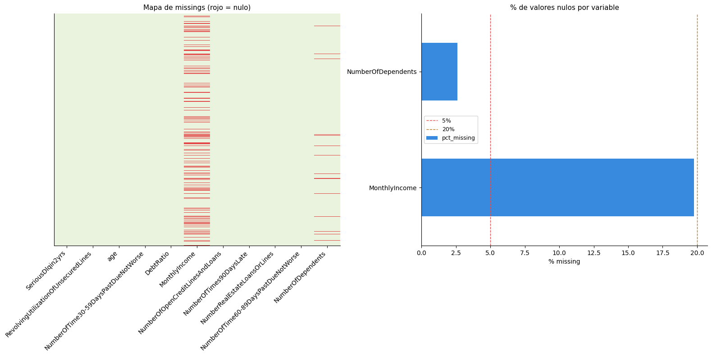
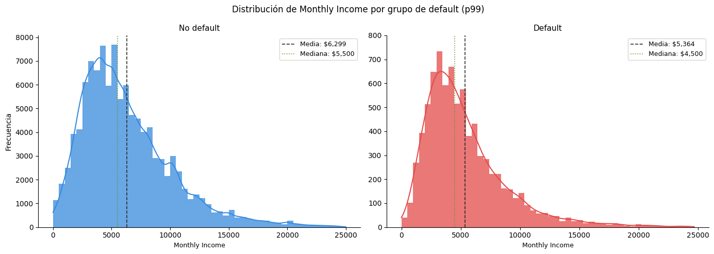

 # 🏦 Credit Default Prediction

> Proyecto de ML end-to-end · Clasificación Binaria · Limpieza de datos · Feature Engineering · Regresión Logística · XGBoost + SHAP + LIME 

    

---

## Resumen

Este proyecto desarrolla un sistema integral y listo para producción para la predicción del riesgo de impago crediticio a partir de datos financieros estructurados. En él, se abarca todo el ciclo de vida del modelo, desde el análisis exploratorio de datos y featuring engineering hasta el entrenamiento de modelos de machine learning y el análisis de explicabilidad mediante valores SHAP. Se evaluaron distintos enfoques, como Regresión Logística y XGBoost, abordando de forma específica el fuerte desbalanceo del conjunto de datos (93%-7%) mediante técnicas adecuadas para este tipo de problemática. XGBoost fue finalmente seleccionado por su sólido rendimiento predictivo y su capacidad para afrontar eficazmente este escenario. El modelo final obtenido permite estimar de manera fiable la probabilidad de que un cliente incurra en dificultades financieras en un horizonte de dos años, contribuyendo así a mejorar la toma de decisiones en concesión de crédito. 

## 🎯 Puntos clave  
- Se ha creado un modelo de ML de predicción de riesgo de morosidad con un dataset amplio (100k+ filas), con una variable target severamente desbalanceada (93%-7%).
- En el eda se han detectado algunos patrones interesantes y útiles para una posible toma de decisiones de negocio.
- En el modelado se ha hecho especial énfasis en maximizar la relación entre recall de la variable minoritaria y la precisión global del modelo (F1-score), ajustando hiperparámetros y threshold acorde a este criterio.
- Se han evaluado diferentes métricas como la precisión global del modelo, F1-Score y AUC-PR, tomando las precauciones necesarias a sabiendas del fuerte sesgo que podría generar el desbalance de la variable respuesta.
- Finalmente se ha analizado la importancia de algunas de las variables más críticas del modelado, utilizando LIME y SHAP.


## Pipeline
```
Limpieza de datos > EDA  ›  Feature Engineering  ›  Entrenamiento y evaluación de los modelos  ›  SHAP Analysis
```


## 📊 Dataset
El presente proyecto ha sido desarrollado utilizando el conjunto de datos:  '[Give me some credit](https://www.kaggle.com/competitions/GiveMeSomeCredit/data)'.
Este conjunto de datos incluye información financiera y de comportamiento de los solicitantes de crédito. Cada fila representa a una persona que solicita un préstamo e incluye atributos como ingresos, deudas, historial de pagos, número de cuentas abiertas y tamaño de la familia. Estos datos permiten analizar el riesgo de incumplimiento y predecir la probabilidad de que un solicitante no pague su deuda.

| Columnas         | Nombre Simplificado   | Descripción                                                          |
| ------------------------------------ | ---------------- | -------------------------------------------------------------------- |
| SeriousDlqin2yrs                     | Moroso           | Variable binaria que indica si la persona no pagó su deuda por más de 90 días (1 = Sí, 0 = No)   |
| RevolvingUtilizationOfUnsecuredLines | Uso de Crédito % | Porcentaje del crédito disponible que se está utilizando actualmente |
| age                                  | Edad             | Edad del prestatario en años                                         |
| NumberOfTime30-59DaysPastDueNotWorse | Retrasos 1 Mes   | Número de veces que el prestatario tuvo un retraso de 1 mes          |
| DebtRatio                            | Deuda vs Ingreso | Deuda mensual y gastos divididos por el ingreso total                |
| MonthlyIncome                        | Ingreso Mensual  | Ingreso mensual bruto del prestatario                                |
| NumberOfOpenCreditLinesAndLoans      | Cuentas Abiertas | Número total de tarjetas de crédito y préstamos activos              |
| NumberOfTimes90DaysLate              | Retrasos 3 Meses | Número de veces que el prestatario tuvo un retraso de 3 o más meses  |
| NumberRealEstateLoansOrLines         | Hipotecas        | Número de préstamos o líneas de crédito inmobiliario                 |
| NumberOfTime60-89DaysPastDueNotWorse | Retrasos 2 Meses | Número de veces que el prestatario tuvo un retraso de 2 meses        |
| NumberOfDependents                   | Tamaño Familiar  | Número de dependientes (hijos, cónyuge u otros)                      |


## Etapas

### 1. Limpieza de datos 


#### 1.1. Datos Faltantes

- Primeramente hemos comprobado aquellas columnas que presentan datos faltantes:



- Como se puede comprobar por el presente gráfico, las variable MontlyIncome y NumberOfDependents son las únicas que presentan missing values.

- En primera instancia trataremos la variable NumberOfDependents, ya que es más intuitiva. Para entenderla veámos la distribución de sus valores:
  
Dependientes | Nº de clientes
-------------|---------------
0            | 86,705
1            | 26,292
2            | 19,501
3            | 9,479
4            | 2,860
5            | 745
6            | 158
7            | 51
8            | 24
9            | 5
10           | 5
13           | 1
20           | 1

- La distribución de la variable muestra que la gran mayoría de los clientes presentan entre 0 y 2 dependientes, concentrando así la mayor parte de las observaciones. Asimismo, se identifican valores atípicos claros (como 10, 13 y 20 dependientes), cuya frecuencia es extremadamente baja y, por tanto, poco representativa del conjunto de datos. En consecuencia, se ha optado por eliminar estos outliers para evitar distorsiones en el análisis. Para la imputación de valores faltantes en el resto de observaciones, se ha utilizado la moda (0), al ser el valor más frecuente y representativo de la distribución.
 
- La variable Montly Income, por otro lado, es más compleja de tratar, esta presenta un 19,77% y una distribución sesgada a la derecha, con algunos outliers extremos.
- Examianamos la distribución de la variable segmentada según la condición de morosidad del cliente, habiendo recortado los outliers más evidentes:




- Dado que la distribución de la variable difiere entre individuos en situación de default y aquellos que no lo están, imputar los valores faltantes utilizando una medida global podría introducir sesgos y distorsionar la relación con la variable objetivo. Por ello, se opta por una imputación más robusta basada en la mediana específica de cada grupo, preservando mejor la estructura real de los datos. Adicionalmente, hemos aplicado una transformación logarítmica, lo que nos permite reducir la asimetría y el efecto de valores extremos, favoreciendo una distribución más estable y adecuada para el modelado.
  
```python
# Realizamos primeramente una transformación logarítmica
df["MonthlyIncome_log"] = np.log1p(df["MonthlyIncome"])

# Imputamos con mediana por grupo de default 
df["MonthlyIncome_log"] = df.groupby("SeriousDlqin2yrs")["MonthlyIncome_log"]\
                            .transform(lambda x: x.fillna(x.median()))
```


### 2. Análisis exploratorio

Univariate and bivariate analysis of demographics, payment history, credit limits, and bill amounts. Includes:

- Class imbalance diagnosis
- Missing value patterns
- Outlier detection via IQR and visual inspection
- Correlation heatmaps and target-stratified distributions


### 🧩 Ingeniería de variables (Feature Engineering)

-Esta sección resume las variables derivadas creadas con el objetivo de mejorar la capacidad predictiva del modelo de riesgo de crédito. Las transformaciones se centran en capturar la capacidad de pago, el comportamiento histórico del cliente y su segmentación.


Esta sección resume las variables derivadas creadas con el objetivo de mejorar la capacidad predictiva del modelo de riesgo de crédito.

| Variable                | Tipo        | Descripción                                                                 | Intuición de riesgo                          |
| ----------------------- | ----------- | --------------------------------------------------------------------------- | -------------------------------------------- |
| `income_per_dependent`  | Numérica    | Ingreso mensual dividido por número de dependientes (+1 para evitar división por cero) | Menor valor → mayor carga financiera         |
| `utilization_capped`    | Numérica    | Utilización de crédito acotada entre 0 y 1                                  | Reduce el impacto de valores extremos        |
| `CreditHistoryLength`   | Numérica    | Edad - 18 (aproximación a la antigüedad crediticia)                         | Mayor antigüedad → menor riesgo              |
| `TotalPastDue`          | Numérica    | Número total de retrasos en pagos                                           | Más retrasos → mayor riesgo                  |
| `weighted_late_score`   | Numérica    | Puntuación ponderada de retrasos según gravedad                             | Penaliza más los impagos severos             |
| `HasSeriousDelinquency` | Binaria     | 1 si existe algún retraso >90 días                                          | Fuerte indicador de default                  |
| `high_utilization_flag` | Binaria     | 1 si la utilización de crédito >80%                                         | Alta utilización → mayor riesgo              |
| `AgeGroup`              | Categórica  | Edad agrupada en rangos                                                     | Captura efectos del ciclo de vida            |
| `IncomeGroup`           | Categórica  | Cuartiles de ingreso                                                        | Segmentación socioeconómica                  |
| `DTICategory`           | Categórica  | Categorías del ratio deuda/ingresos (DTI)                                   | Mayor DTI → menor capacidad de pago          |

### 📊 Comparativa de Modelos

Se evaluaron dos modelos para el problema de clasificación:

- Regresión Logística (baseline optimizado)
- XGBoost (modelo avanzado optimizado)

---

#### 🔎 Resultados: Regresión Logística (Optimizada)

| Clase | Precisión | Recall | F1-score | Soporte |
|------|----------|--------|----------|---------|
| 0    | 0.97     | 0.87   | 0.92     | 27,996  |
| 1    | 0.26     | 0.65   | 0.37     | 1,948   |

| Métrica global     | Valor |
|-------------------|------|
| Accuracy          | 0.86 |
| Macro Avg F1      | 0.64 |
| Weighted Avg F1   | 0.88 |
| AUC-PR            | 0.8508 |

---

#### 🔎 Resultados: XGBoost (Optimizado)

| Clase | Precisión | Recall | F1-score | Soporte |
|------|----------|--------|----------|---------|
| 0    | 0.97     | 0.93   | 0.95     | 27,996  |
| 1    | 0.40     | 0.66   | 0.50     | 1,948   |

| Métrica global     | Valor |
|-------------------|------|
| Accuracy          | 0.91 |
| Macro Avg F1      | 0.72 |
| Weighted Avg F1   | 0.92 |
| AUC-ROC           | 0.8765 |

---

####  ⚖️ Comparación Directa

| Métrica              | Regresión Logística | XGBoost |
|---------------------|--------------------|--------|
| Accuracy            | 0.86               | 0.91   |
| F1-score (Clase 1)  | 0.37               | 0.50   |
| Recall (Clase 1)    | 0.65               | 0.66   |
| Precisión (Clase 1) | 0.26               | 0.40   |

---

### 🎯 Optimización de Threshold

Dado el fuerte desbalance de clases, no se utilizó el threshold por defecto (0.5).  
En su lugar, se optimizó el umbral de decisión priorizando:

> **Recall ≥ 0.65 en la clase positiva**

---

#### 🔎 Thresholds seleccionados

| Modelo              | Threshold óptimo | Criterio |
|---------------------|-----------------|----------|
| Regresión Logística | 0.01            | Maximizar recall ≥ 0.65 |
| XGBoost             | 0.3268          | Maximizar recall ≥ 0.65 |

---

### 🧠 Interpretación

#### Regresión Logística (threshold = 0.01)

- Threshold extremadamente bajo  
- El modelo clasifica casi todo como positivo
- Resultado:
  - ✅ Alto recall (detecta muchos positivos)
  - ❌ Muy baja precisión (muchos falsos positivos)

👉 Indica que el modelo **no separa bien las clases**

---

#### XGBoost (threshold = 0.3268)

- Threshold más razonable
- Mantiene recall ≥ 0.65 sin colapsar la precisión

👉 Indica que el modelo:
- Tiene mejor capacidad de discriminación
- Permite un balance más realista entre métricas

---

### ⚖️ Implicaciones de negocio

- Reducir el threshold aumenta el recall pero también los falsos positivos
- Aumentarlo mejora precisión pero pierde casos positivos

👉 La elección depende del coste relativo de:
- Falsos negativos (casos no detectados)
- Falsos positivos (alarmas innecesarias)

---

### 📌 Conclusión sobre thresholds

- El threshold de la Regresión Logística evidencia sus limitaciones
- XGBoost permite un ajuste más equilibrado y usable en producción

👉 Esto refuerza la elección de XGBoost como modelo final

### 🧠 Análisis De los resultados

#### 1. Desbalance de clases

El dataset presenta un fuerte desbalance:
- Clase 0: ~93%
- Clase 1: ~7%

Esto hace que:
- Accuracy sea una métrica limitada
- Sea clave analizar recall, precisión y F1 en la clase minoritaria

---

#### 2. Regresión Logística

- Buen rendimiento en la clase mayoritaria
- Recall aceptable en clase 1 (0.65)
- **Problema principal:** precisión muy baja (0.26)
  - Muchos falsos positivos
- Modelo simple, interpretable, pero limitado para capturar relaciones complejas
- **AUC-PR (Logística): 0.8508** : Métrica adecuada para desbalance

👉 En la práctica: sirve como baseline, pero no es suficiente

---

#### 3. XGBoost

- Mejora clara en todas las métricas clave
- **Gran mejora en precisión de la clase 1 (0.26 → 0.40)**
- Recall prácticamente igual (0.66)
- F1-score mucho más equilibrado (0.50)
- **AUC-PR (XGBoost): 0.8765** : Buena separación entre clases

👉 Traducción real:
- Detecta los mismos positivos…
- …pero comete muchos menos falsos positivos
- 
---

## 🚀 Conclusión

XGBoost es claramente superior a la Regresión Logística en este problema:

- Mejora significativa en la detección de la clase minoritaria
- Mejor equilibrio entre precisión y recall
- Mayor robustez global

👉 Es el modelo recomendado para producción.

---

## ⚠️ Limitaciones

- Precisión en clase positiva aún moderada (0.40)
- Persisten falsos positivos
- Dataset desbalanceado sigue siendo un reto

---

## 🔧 Próximos pasos

- Técnicas de balanceo (SMOTE, undersampling)
- Optimización enfocada en métricas de negocio:
  - Recall: evaluar en términos monetarios si perder positivos es crítico.
  - Precisión: evaluar si incurrir en falsos positivos es costoso.
- Feature engineering adicional
- Ensemble de modelos

---

#### 📌 Decisión final

Se selecciona **XGBoost** como modelo final por ofrecer el mejor trade-off entre:

- Detección de la clase positiva
- Reducción de falsos positivos
- Rendimiento global

