# 🏦 Credit Default Prediction

> End-to-end ML Project · Binary Classification · Data Cleaning · Feature Engineering · Logistic Regression · XGBoost + SHAP + LIME 


---

## Summary

This project develops a comprehensive system aimed at predicting credit default risk from structured financial data. The full analytical lifecycle is covered, from exploratory data analysis (EDA) and feature engineering through to training, validation and evaluation of machine learning models, also incorporating explainability techniques via SHAP and LIME.

Several approaches were evaluated, including Logistic Regression, XGBoost and LightGBM, with particular attention paid to the strong class imbalance present in the dataset (93% non-default / 7% default) using strategies suited to this type of problem.

Ultimately, XGBoost was selected as the final model due to its solid predictive performance and its ability to handle this scenario effectively. The model estimates the probability that a customer will experience financial difficulties within a two-year horizon, enabling better decision-making in credit granting and risk management processes.

## 🎯 Key Highlights

- An ML model for default risk prediction was built on a large dataset (100k+ rows) with a severely imbalanced target variable (93%–7%).
- An exhaustive data cleaning and preprocessing pipeline was carried out on a dataset of over 100k records to ensure data quality prior to modelling. This process included identifying and removing erroneous or inconsistent data, handling observations with outliers or out-of-range values, and managing missing values through specific strategies tailored to each variable and situation.
- An Exploratory Data Analysis (EDA) was conducted to understand the dataset structure and the main factors associated with default risk. The study included analysis of predictor variable distributions, the distribution of the target variable, variable behaviour in higher-risk profiles, the relationship between payment delinquency history and default probability, and a segmented analysis by age group to identify differential patterns across cohorts.
- Additionally, a feature engineering process was carried out to generate relevant variables capable of capturing each individual's credit history and improving the model's ability to discriminate between different levels of default risk.
- During modelling, particular emphasis was placed on optimising the balance between minority class recall and overall model precision (F1-score), tuning hyperparameters and threshold accordingly. Given business requirements, a minimum recall of 0.65 for the minority class was established, and from there the configuration with the best F1-score for that class was selected.
- The final selected model was XGBoost, which particularly stands out for an AUC-PR of 0.91, a key metric in problems with strong class imbalance. With a threshold of 0.3268, the model also achieved a recall of 0.66, precision of 0.40 and F1-score of 0.50 on the minority class — solid and consistent results given the strong imbalance of the target variable.
- Finally, the most influential variables of the final model were analysed using LIME and SHAP, identifying that those related to late payment history and accumulated delinquency are the main predictors of default.


## Pipeline
```
Data Cleaning > EDA  ›  Feature Engineering  ›  Model Training & Evaluation  ›  Feature Importance
```


## 📊 Dataset
This project was developed using the dataset: '[Give me some credit](https://www.kaggle.com/competitions/GiveMeSomeCredit/data)'.
This dataset includes financial and behavioural information about credit applicants. Each row represents a person applying for a loan and includes attributes such as income, debt, payment history, number of open accounts and family size. This data allows analysis of default risk and prediction of the probability that an applicant will fail to repay their debt.

| Columns                              | Simplified Name    | Description                                                          |
| ------------------------------------ | ------------------ | -------------------------------------------------------------------- |
| SeriousDlqin2yrs                     | Defaulter          | Binary variable indicating whether the person failed to pay their debt for more than 90 days (1 = Yes, 0 = No) |
| RevolvingUtilizationOfUnsecuredLines | Credit Utilisation % | Percentage of available credit currently being used               |
| age                                  | Age                | Age of the borrower in years                                         |
| NumberOfTime30-59DaysPastDueNotWorse | 1-Month Delays     | Number of times the borrower was 1 month late on a payment           |
| DebtRatio                            | Debt vs Income     | Monthly debt and expenses divided by total income                    |
| MonthlyIncome                        | Monthly Income     | Gross monthly income of the borrower                                 |
| NumberOfOpenCreditLinesAndLoans      | Open Accounts      | Total number of active credit cards and loans                        |
| NumberOfTimes90DaysLate              | 3-Month Delays     | Number of times the borrower was 3 or more months late on a payment  |
| NumberRealEstateLoansOrLines         | Mortgages          | Number of real estate loans or lines of credit                       |
| NumberOfTime60-89DaysPastDueNotWorse | 2-Month Delays     | Number of times the borrower was 2 months late on a payment          |
| NumberOfDependents                   | Family Size        | Number of dependants (children, spouse or others)                    |


## 🧹 1. Data Cleaning

In this phase, various cleaning tasks were carried out to improve the quality and consistency of the dataset, removing inconsistent records prior to modelling. Additionally, missing values present in the data were also addressed.


### 1.1 General Cleaning


- **`age` depuration:** observations with implausible ages were removed, specifically values below 18 and above 110.
- **Removal of irrelevant columns:** `Unnamed: 0` was discarded, as it only corresponded to a residual index.
- **Outlier treatment:** anomalous records were detected in the variables `NumberOfTime30-59DaysPastDueNotWorse`, `NumberOfTime60-89DaysPastDueNotWorse` and `NumberOfTime90DaysPastDueNotWorse`, related to payment delinquency history. These cases were removed to avoid distortions in the analysis. Records removed for this last reason represented only 270 observations, so the information loss was minimal relative to the total dataset size.


### 1.2 Missing Data

The problem of missing data was then addressed. First, the affected columns were identified along with the extent of the impact.

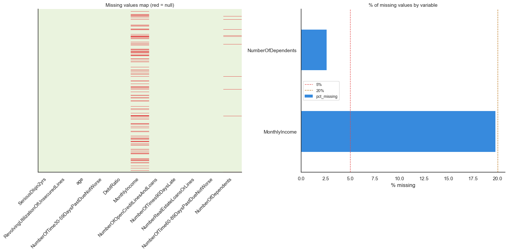

- As shown in the chart, the variables `MonthlyIncome` and `NumberOfDependents` are the only ones with missing values.

#### 1.2.1 NumberOfDependents

- First, the variable `NumberOfDependents` will be addressed, as it is more intuitive. To better understand it, let us look at the distribution of its values:
  
Dependants | No. of clients
-----------|---------------
0          | 86,705
1          | 26,292
2          | 19,501
3          | 9,479
4          | 2,860
5          | 745
6          | 158
7          | 51
8          | 24
9          | 5
10         | 5
13         | 1
20         | 1

- The variable's distribution shows that the vast majority of customers have between 0 and 2 dependants, concentrating most observations. Clear outliers are also identified (such as 10, 13 and 20 dependants), whose frequency is extremely low and therefore not representative of the dataset. Consequently, these outliers have been removed to avoid distortions in the analysis. For imputing missing values in the remaining observations, the mode (0) was used, as it is the most frequent and representative value of the distribution.

#### 1.2.2 Monthly Income
- The variable `MonthlyIncome`, on the other hand, is more complex to handle; it presents 19.77% missing values and a right-skewed distribution with some extreme outliers.
- The distribution of the variable segmented by the customer's default status is examined, having trimmed the most obvious outliers:

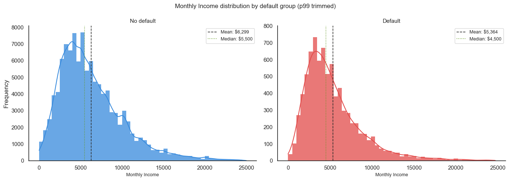


- Since the distribution of the variable differs between individuals in default and those who are not, imputing missing values using a global measure could introduce biases and distort the relationship with the target variable. Therefore, a more robust imputation based on the median specific to each group is chosen, better preserving the real structure of the data. Additionally, a logarithmic transformation was applied, which reduces skewness and the effect of extreme values, resulting in a more stable and suitable distribution for modelling.
  
```python
# First apply a logarithmic transformation
df["MonthlyIncome_log"] = np.log1p(df["MonthlyIncome"])

# Impute with median by default group
df["MonthlyIncome_log"] = df.groupby("SeriousDlqin2yrs")["MonthlyIncome_log"]\
                            .transform(lambda x: x.fillna(x.median()))
```


## 📈 2. Exploratory Analysis


### 2.1 Distribution of Predictor Variables

In this section, the distribution of numerical variables was analysed with the aim of better understanding the dataset structure, identifying skewness, detecting extreme values and anticipating potential preprocessing needs before modelling. To facilitate visualisation, some variables were represented with visual trimming at the 99th percentile for a cleaner display.


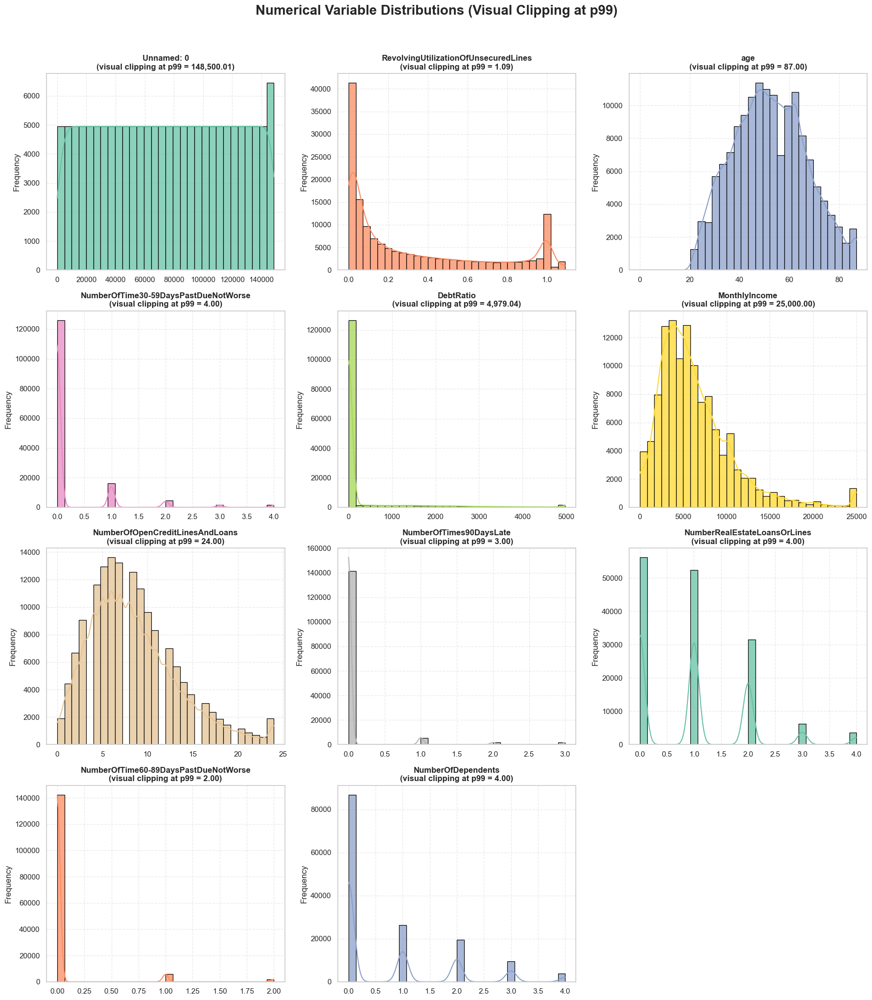

**Main observations:**

- Variables such as `MonthlyIncome` and `DebtRatio` show strong positive skewness, with high concentration at low values and a long tail of extreme values.
- `RevolvingUtilizationOfUnsecuredLines` also shows right skew, with a large accumulation near zero and some high-value cases.
- `age` has a relatively stable distribution close to a unimodal shape, concentrating mainly between 35 and 65 years.
- Variables related to delinquency (`NumberOfTime30-59DaysPastDueNotWorse`, `NumberOfTimes90DaysLate` and `NumberOfTime60-89DaysPastDueNotWorse`) show strong zero-inflation, indicating that most customers have no recent payment delays.
- Variables such as `NumberRealEstateLoansOrLines`, `NumberOfOpenCreditLinesAndLoans` and `NumberOfDependents` have a discrete nature with clear concentrations at certain integer values.

**Implications for modelling:**

- The presence of skewness and outliers justifies the use of robust scaling techniques or transformations for certain variables.
- The zero-inflation observed in delinquency variables may provide high predictive power as it is closely tied to credit risk.
- This analysis is particularly relevant for linear models such as logistic regression, while tree-based models tend to be more robust to these types of distributions.


### 2.2 Distribution of the Target Variable

The target variable shows a marked class imbalance, with non-default cases being overwhelmingly dominant over default events. This behaviour is expected in real credit portfolios, where the delinquency rate is typically low. However, this asymmetry may bias predictive model training towards the dominant class, so imbalance-robust metrics and specific techniques such as class weighting or resampling will be used during the modelling phase.

<p align="center">
  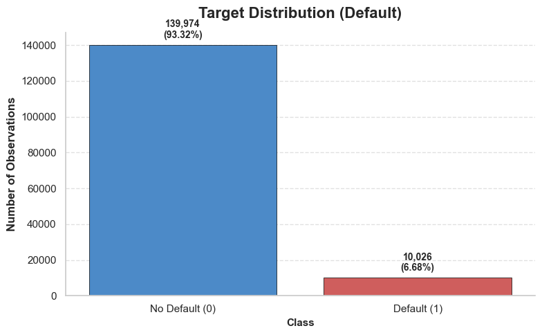
</p>


### 2.3 Default Behavior Analysis

Under this section, the analysis focuses on understanding how the likelihood of default changes across different customer groups and financial profiles. The study includes the estimation of the mean default rate together with both parametric (95% normal confidence intervals) and non-parametric (bootstrap confidence intervals) uncertainty estimates, providing a more robust view of risk behavior. In addition, differences between key segments — such as age ranges, income levels, delinquency history, and credit exposure — are explored to identify patterns associated with higher default probability. To complement the visual analysis, statistical techniques including Levene’s test and Cliff’s Delta are applied to evaluate variance differences and effect sizes between groups, helping distinguish statistically meaningful relationships from purely descriptive patterns.

#### 2.3.1 COnfidence Interval

To quantify the uncertainty around the estimated default rate, we compute a 95% confidence interval using the Wilson method, which provides better performance than the normal approximation, especially for proportions close to 0 or 1 or when class imbalance is present. This interval gives a statistically robust range for the true population default rate based on the observed sample.

In addition to the analytical approach, we also estimate confidence intervals using bootstrap resampling. This method repeatedly samples from the dataset with replacement and recalculates the default rate, allowing us to empirically approximate its sampling distribution. The resulting interval does not rely on strong parametric assumptions and is therefore particularly useful for validating the robustness of the analytical estimate.

Together, both approaches provide complementary perspectives: the Wilson interval offers a closed-form statistical estimate, while bootstrap methods provide a data-driven, assumption-light validation of uncertainty.

<p align="center">
  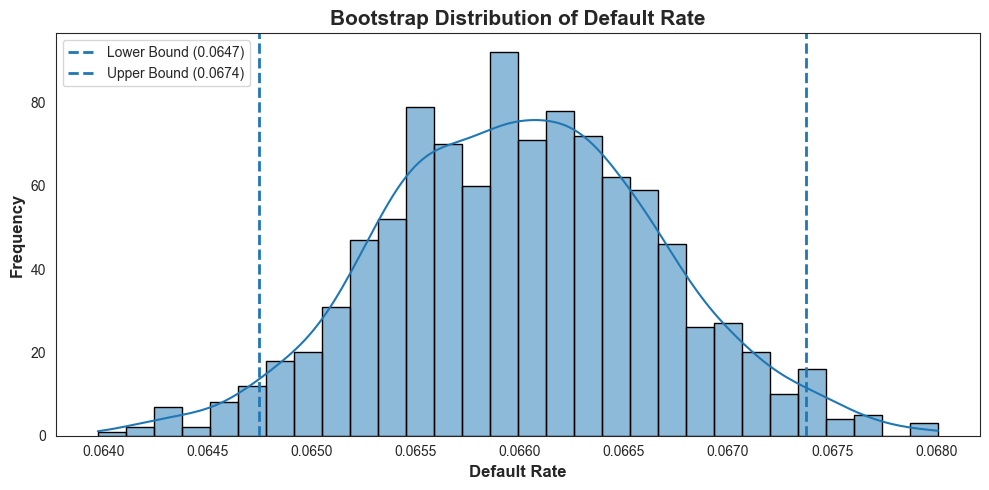
</p>

The estimated mean default rate in the dataset is **0.0660**, indicating that approximately 6.6% of the observed individuals are classified as defaulters.

To quantify the uncertainty of this estimate, we compute a 95% confidence interval using the Wilson method, obtaining a range of **[0.0647, 0.0672]**. This provides a precise analytical estimate of the true population default rate.

To validate the robustness of this result, we also apply a bootstrap approach, which yields a very similar 95% confidence interval of **[0.0647, 0.0674]**. The close agreement between both intervals reinforces the stability of the estimated default rate and suggests that the result is not sensitive to the underlying assumptions of the analytical method.

Overall, both methods consistently indicate a low and tightly concentrated default rate in the dataset.

#### 2.3.2 Feature Distribution by Default Status

This section reveals clear differences between customers with and without payment default. On average, customers who do not default have higher monthly income, a slightly older age and lower debt ratios, while the default group concentrates profiles with lower income capacity and greater financial pressure. These variables show a consistent relationship with credit risk, making them particularly relevant for building predictive models aimed at estimating default probability and improving decision-making in credit granting.

<p align="center">
  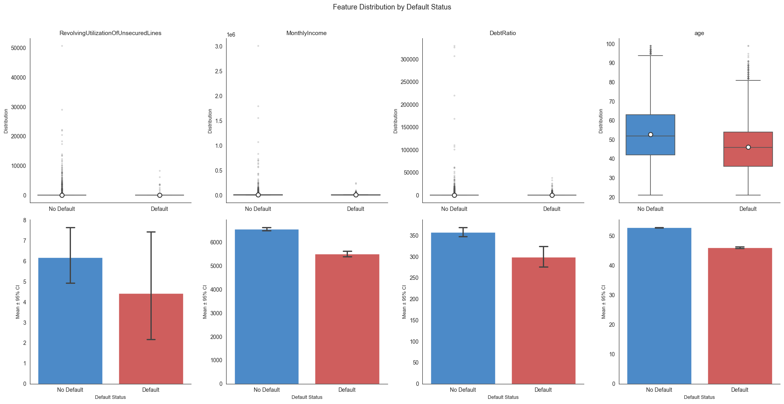
</p>

Comparison of key financial features between defaulting and non-defaulting borrowers reveals meaningful differences across all variables analyzed. Non-defaulters show a higher average revolving utilization of unsecured lines (~6.1 vs ~4.4), a higher monthly income (~$6,500 vs ~$5,500), and a higher debt ratio (~360 vs ~300), suggesting that defaulters tend to have a weaker overall financial profile despite lower absolute exposure. Age also differs notably: non-defaulters have a higher median age (~52) compared to defaulters (~46), consistent with the findings from the age-group analysis. While distributions are heavily right-skewed and contain extreme outliers across all features, the mean differences are statistically distinguishable, making these variables relevant predictors for credit risk modeling.


#### 2.3.3 Delinquency and Default History

A borrower's history of late payments is often considered one of the most direct signals of future credit risk. The following analysis examines how the frequency of past delinquencies — across three severity buckets — relates to the likelihood of serious default, revealing a clear and consistent escalation in risk with each additional missed payment.

<p align="center">
  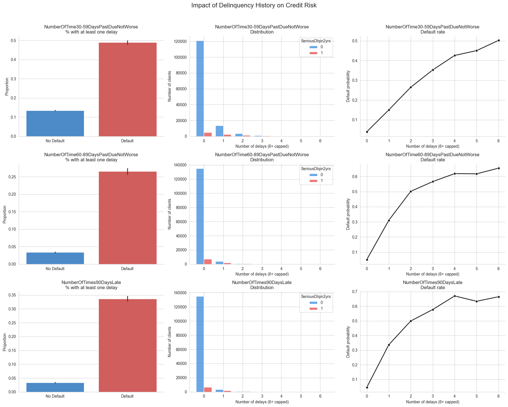
</p>


Past delinquency behavior proves to be one of the strongest indicators of future default risk. Across all three delinquency buckets — 30–59, 60–89, and 90+ days past due — defaulters show a substantially higher proportion of clients with at least one recorded delay compared to non-defaulters. The default probability curves further confirm a steep, monotonic increase with the number of delays: even a single 60–89 day late event raises the default probability to roughly 50%, and borrowers with repeated 90+ day delinquencies face default rates exceeding 65%. These patterns highlight delinquency history as a critical feature that should be prioritized in any predictive credit risk model.


### 2.4 Analysis by Age Group

This analysis explores the relationship between customers' age and their credit behaviour, focusing on default probability and different levels of delinquency. Through segmentation by age groups, the aim is to identify risk patterns that can improve the predictive capacity of the credit risk model.
  
<p align="center">
  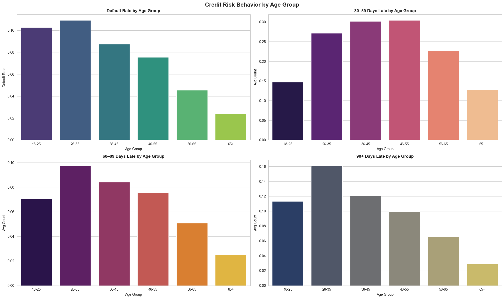
</p>

The chart shows a clear concentration of risk in middle-age groups, especially between 36 and 55 years, where the highest rates of both default and delays across different ranges (30–59 and 60–89 days) are observed. The 46–55 age group stands out as the segment with the highest volume of defaults and accumulated delinquency, suggesting a combination of greater credit exposure and potential financial stress. In contrast, the younger (18–25) and older (65+) segments show significantly lower levels of default, which may be associated with lower credit access or more conservative behaviour.

<p align="center">
  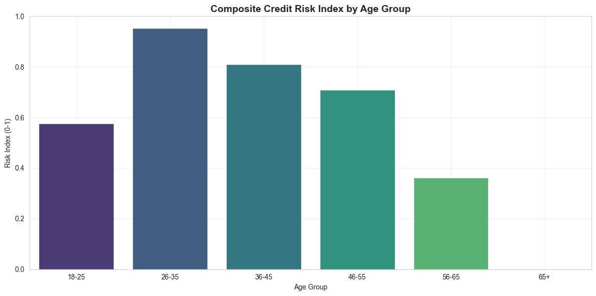
</p>

### 2.5 Correlations
- Finally, the correlation matrix is examined with the aim of identifying which variables show the greatest association with the target variable SeriousDlqin2yrs, as well as potential multicollinearity issues between features. This analysis is particularly useful for understanding which signals provide the most predictive value and for guiding both variable selection and the construction of new transformations to improve model performance and interpretability.
  
<p align="center">
  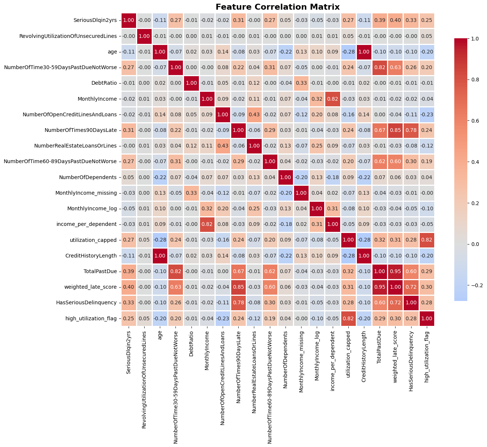
</p>

**Observations**
- The correlation analysis shows that the target variable SeriousDlqin2yrs (default) is primarily associated with late payment behaviour indicators, with `weighted_late_score`, `TotalPastDue` and `NumberOfTimes90DaysLate` showing the highest positive correlations. This confirms that recent delinquency history is the main driver of default risk.
- Derived variables such as `HasSeriousDelinquency` and the various delay counters (30–59 and 60–89 days) also reinforce this signal, evidencing a coherent structure among related features. On the other hand, variables such as `age` and `CreditHistoryLength` show moderate negative correlations, suggesting that more mature profiles with a longer credit history tend to have a lower probability of default.
- In contrast, classic financial variables such as `DebtRatio` or `MonthlyIncome` have a weak relationship with the target variable, suggesting that in this dataset, historical behaviour is far more predictive than declared economic capacity. Finally, some multicollinearity is observed among delinquency-derived variables, which will be taken into account in later modelling phases to avoid redundancy and improve model interpretability.


## 🧩 3. Feature Engineering

This section summarises the derived variables created with the aim of improving the predictive capacity of the credit risk model. The transformations focus on capturing payment capacity, the customer's historical behaviour and their segmentation.


| Variable                | Type        | Description                                                                 | Risk Intuition                               |
| ----------------------- | ----------- | --------------------------------------------------------------------------- | -------------------------------------------- |
| `income_per_dependent`  | Numerical   | Monthly income divided by number of dependants (+1 to avoid division by zero) | Lower value → greater financial burden     |
| `utilization_capped`    | Numerical   | Credit utilisation capped between 0 and 1                                   | Reduces the impact of extreme values         |
| `CreditHistoryLength`   | Numerical   | Age - 18 (approximation of credit history length)                           | Longer history → lower risk                  |
| `TotalPastDue`          | Numerical   | Total number of payment delays                                              | More delays → higher risk                    |
| `weighted_late_score`   | Numerical   | Weighted score of delays by severity                                        | Penalises severe delinquencies more heavily  |
| `HasSeriousDelinquency` | Binary      | 1 if there is any delay >90 days                                            | Strong indicator of default                  |
| `high_utilization_flag` | Binary      | 1 if credit utilisation >80%                                                | High utilisation → higher risk               |
| `AgeGroup`              | Categorical | Age grouped into ranges                                                     | Captures life-cycle effects                  |
| `IncomeGroup`           | Categorical | Income quartiles                                                            | Socioeconomic segmentation                   |
| `DTICategory`           | Categorical | Debt-to-income ratio (DTI) categories                                       | Higher DTI → lower repayment capacity        |

## 📊 4. ML Model Development

As previously mentioned, the dataset presents a marked class imbalance (93% non-default / 7% default), which significantly hinders the identification of the minority class (default).
In this context, metrics such as overall accuracy can be misleading, as a model that always predicted the majority class (non-default) would achieve 93% accuracy without providing any real value. For this reason, model optimisation focused on the F1-Score of class 1, a metric that combines precision and recall in a balanced way.
Additionally, a minimum recall of 65% was set as a constraint, with the aim of ensuring detection of at least two thirds of real default cases.
Finally, AUC-PR (Area Under the Precision-Recall Curve) was also considered, which is especially relevant in scenarios with strong class imbalance.

Several models were evaluated to address the classification problem, among which the following stand out:

- Logistic Regression, used as a baseline model to establish an initial performance benchmark.
- XGBoost, considered as a more advanced alternative with greater predictive capacity.
- Other approaches such as LightGBM and Random Forest were also analysed; however, XGBoost was the model that achieved the best results across the evaluated metrics.

---


### 4.1 Logistic Regression *(baseline)*

As a first step, as is common in the literature for this type of problem, a logistic regression model was fitted. Due to the class imbalance problem, the model was built with appropriately adjusted weights.

| Metric    | Class 0 (non-default) | Class 1 (default) |
|-----------|-----------------------|-------------------|
| Precision | 0.97                  | 0.26              |
| Recall    | 0.87                  | 0.65              |
| F1-Score  | 0.92                  | 0.37              |
| **AUC-PR** | **0.8508** | **Threshold: 0.5800** |

After evaluating multiple models, the best-performing one achieves an AUC-PR of 0.8508 with an optimal threshold of 0.58. For the minority class (default), the model reaches the maximum F1-Score at the minimum required recall of 65%, thus meeting the objective of detecting a relevant proportion of real cases. However, this result is achieved with a precision of only 0.26, meaning that only 1 in 4 customers classified as default actually is. Consequently, the model generates a high volume of false positives, producing approximately three incorrect alerts for every correct one. Its F1-Score of 0.37 confirms low discriminative capacity, so this model will serve only as a comparative reference against more sophisticated approaches.

---

### 4.2 XGBoost *(final model)*

As a second approach, an XGBoost model was trained with hyperparameter tuning via randomised cross-validation (RandomCV). Compared to the baseline, it outperforms the logistic model on all relevant metrics:

| Metric    | Class 0 (non-default) | Class 1 (default) |
|-----------|-----------------------|-------------------|
| Precision | 0.97                  | 0.40              |
| Recall    | 0.93                  | 0.66              |
| F1-Score  | 0.95                  | 0.50              |
| **AUC-PR** | **0.9021** | **Threshold: 0.3268** |

This model required lowering the decision threshold to **0.3268** (well below the default 0.5) to achieve the target recall. This reflects that the model, trained on imbalanced data, tends to assign low probabilities to the minority class, and the classification threshold must be reduced to capture more real defaults.

With this adjustment, the model detects **66% of real defaults** (recall), with an associated precision of 40%: that is, out of every 10 customers classified as default, 6 actually are and 4 are false alarms. This trade-off is common and generally acceptable in credit risk contexts, where the cost of missing a default far exceeds that of investigating a false alarm. The **F1-Score of 0.50** reflects this balance in a highly challenging scenario. Additionally, the model yields an AUC-PR of 0.9021.

---

### 4.3 Comparison and Conclusion

| Model                | Threshold | Precision (c1) | Recall (c1) | F1 (c1) | AUC-PR |
|----------------------|-----------|----------------|-------------|---------|--------|
| **XGBoost**          | 0.3268    | **0.40**       | **0.66**    | **0.50**| **0.90** |
| Logistic Regression  | 0.5800    | 0.26           | 0.65        | 0.37    | 0.85   |

The most significant improvement lies in precision (+14 p.p.), which translates into an F1-Score 35% higher (0.50 vs. 0.37) and an AUC-PR 5 points greater, while maintaining virtually identical recall. In other words, XGBoost detects the same proportion of real defaults while generating considerably fewer false alarms.
In a credit scoring context, this difference has direct practical implications: a more refined list of at-risk customers reduces operational review costs and avoids unnecessary friction with customers who would not have defaulted. For all these reasons, XGBoost is selected as the final model for the project.

## 🔧 5. Feature Importance

To ensure transparency of the final model (XGBoost), three complementary interpretability techniques were applied: **Feature Importance (Gain)** for a global view of each variable's predictive power, **LIME** for explanations at the individual instance level, and **SHAP** to understand the directional impact of each feature on predictions.

All three techniques converge on a clear conclusion: the customer's historical payment behaviour is, by far, the most determining factor in predicting default.

---

### 5.1 Gain-Based Importance

The gain importance chart reflects how much each variable contributes to reducing impurity in the model's trees. The two dominant features are `weighted_late_score` and `TotalPastDue`, with noticeably higher importance than the rest — roughly twice that of the third most relevant variable — indicating that the model relies very heavily on the customer's late payment history. Next come `HasSeriousDelinquency` and `NumberOfTimes90DaysLate`, which reinforce the same signal: severe and repeated delays are the most robust predictor of default. At a secondary level of importance are `high_utilization_flag` and `utilization_capped`, indicating that the level of available credit utilisation also provides valuable information, though well below the delinquency variables. The remaining features — income, debt-to-income ratio, number of open lines — contribute marginally in terms of gain.

---

<p align="center">
  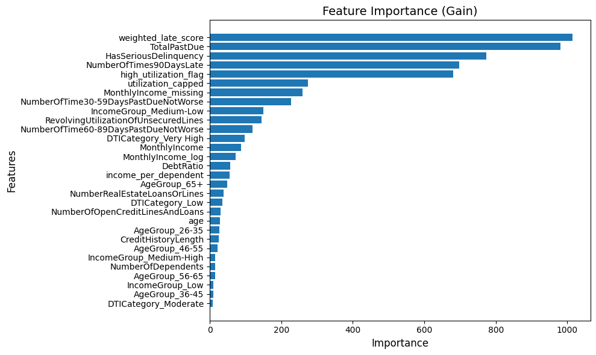
</p>

### 5.2 LIME

The LIME explanation corresponds to a specific instance classified as **Default** and allows us to understand which factors led the model to that particular decision. The variable with the greatest negative weight (pushing towards default) is `MonthlyIncome_missing <= 0`, confirming that the absence of income data is the most determining individual signal in this case. This is followed by `MonthlyIncome > 7403` and `weighted_late_score <= 0`, which may seem counterintuitive — high income pushing towards default — but is explained by the fact that LIME analyses local combinations of conditions: in this specific profile, other risk factors prevail over income level. `TotalPastDue <= 0` and `MonthlyIncome_log > 8.91` also contribute negatively. In the opposite direction, `high_utilization_flag <= 0` and `NumberRealEstateLoansOrLines > 2` act as slight risk-mitigating factors for this particular instance.

---

<p align="center">
  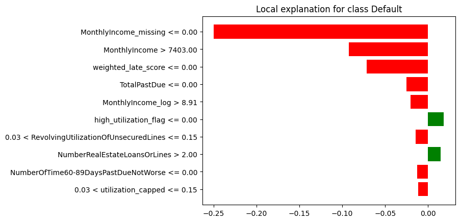
</p>

### 5.3 SHAP

The SHAP analysis complements gain-based importance by adding the **direction** of each variable's effect on the default probability. `weighted_late_score` again leads: high values (in red) are associated with positive SHAP values, pushing the prediction towards default, while low values reduce risk. `TotalPastDue` shows a similar pattern though with less dispersion, and `utilization_capped` also has a positive impact when elevated.

A particularly relevant finding is the behaviour of `MonthlyIncome_missing`: the absence of income data generates strongly positive SHAP values (higher default risk), suggesting that the lack of income information is itself a risk signal that the model has learned to exploit. Conversely, high values of `MonthlyIncome` act as a protective factor, pushing predictions towards non-default. The variable `age` shows a moderate protective effect for older customers, consistent with the credit risk literature.

---


<p align="center">
  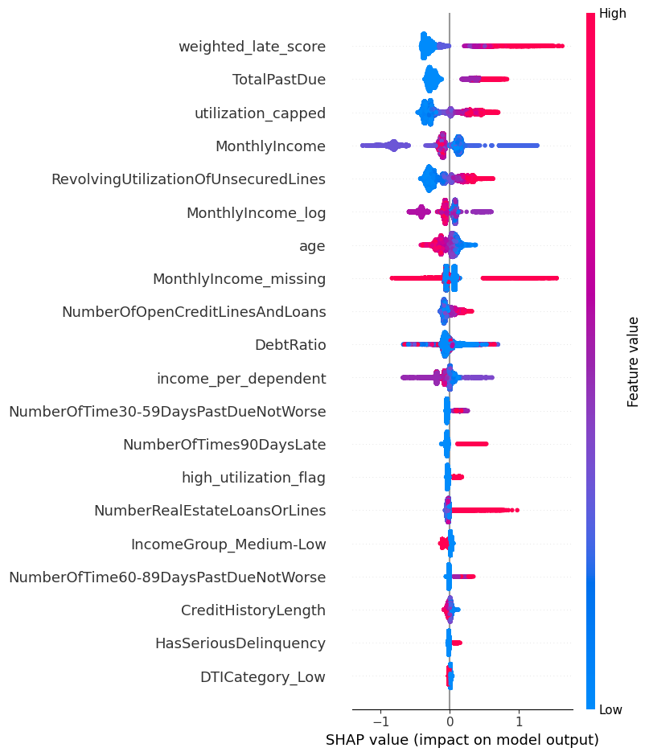
</p>


> All three interpretability techniques are consistent with each other and point to the same explanatory core: **late payment history and accumulated delinquency are the dominant predictors of default**, followed at a distance by credit utilisation level and the availability of income information. This coherence between global and local methods reinforces confidence in the model and facilitates its potential use in regulated environments where the explainability of credit decisions is a requirement.


## ➡️ 6. Next Steps

- Expansion of the EDA.
- More advanced balancing techniques such as SMOTE or undersampling.
- Optimisation focused on business metrics:
  - Recall: evaluate in monetary terms the exact degree of missed defaults.
  - Precision: evaluate how costly it is to incur false positives.
- Model ensembling.


---


